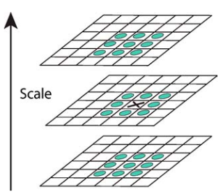

# SLAM Basics | SIFT特征

## 0.概述

SIFT特征[^sift]（Scale Invariant Feature Transform）

## 1. 理论基础

### 1.1 尺度空间

图像$I(x,y)$的尺度空间定义为函数$L(x,y,\sigma)$，满足：

\[
L(x,y,\sigma)=G(x,y,\sigma)*I(x,y)
\]

其中$*$为卷积运算，$G(x,y,\sigma)$为Gaussian核，满足：

\[
G(x,y,\sigma)=\frac{1}{2\pi\sigma^2}\exp\left(-\frac{x^2+y^2}{2\sigma^2}\right)
\]

### 1.2 候选特征点检测

尺度空间中的候选特征点定义为DoG函数（Difference of Gaussian）的局部极值，DoG函数$D(x,y,\sigma)$由尺度空间中相差常数因子$k$的两层计算，即：

\[
\begin{aligned}
D(x,y,\sigma)&=(G(x,y,k\sigma)-G(x,y,\sigma))*I(x,y)\\[5pt]
             &=L(x,y,k\sigma)-L(x,y,\sigma)
\end{aligned}
\]

采用DoG函数的原因有二：一是DoG函数可以简单地由尺度空间$L(x,y,\sigma)$计算，而$L(x,y,\sigma)$的获取是描述尺度空间必须进行的计算；二是DoG函数为尺度归一化LoG（Laplacian of Gaussian）函数$\sigma^2\nabla^2G$的近似，后者的局部极值被验证相较于梯度、Hessian和Harris响应函数可以产生最稳定的图像特征。

??? note "DoG函数近似尺度归一化LoG函数推导"
    Gaussian核$G(x,y,\sigma)$为热扩散方程的解，即有：

    \[
    \frac{\partial G}{\partial\sigma}=\sigma\nabla^2G\triangleq\sigma\left(\frac{\partial^2G}{\partial x^2}+\frac{\partial^2G}{\partial y^2}\right)
    \]

    因此有：

    \[
    \sigma\nabla^2G=\frac{\partial G}{\partial\sigma}\approx\frac{G(x,y,k\sigma)-G(x,y,\sigma)}{k\sigma-\sigma}
    \]

    \[
    \Rightarrow G(x,y,k\sigma)-G(x,y,\sigma)\approx(k-1)\sigma^2\nabla^2G
    \]

    \[
    \Rightarrow D(x,y,\sigma)\approx\sigma^2\nabla^2G*I(x,y)
    \]

    由于$k-1$为常数，其不影响局部极值位置，当$k\to1$时，近似误差$\to0$。

DoG函数的构造如[图](#fig-dog){.fig-ref}所示，具体步骤如下：

1. **尺度空间划分：**将每个倍频程（Octave，即尺度$\sigma$翻倍的过程）划分为$s$个等比间隔，确定相邻尺度的比例因子$k=2^{\frac{1}{s}}$。

2. **增量式Gaussian卷积：**在每个倍频程中，对初始图像进行增量式Gaussian卷积，生成$s+3$张图像，即$s+3$层（Layer）。

3. **计算DoG：**将相邻层图像作差，得到$s+2$张DoG图像，用于后续的局部极值检测。

4. **倍频程迭代：**一个倍频程处理完后，选取其中尺度$\sigma$为初始值$2$倍的高斯图像（第$s$层），进行隔行隔列采样，作为下一个倍频程的初始图像。第$0$个倍频程的初始图像即为原始图像。

<figure id="fig-dog" markdown="span">
    {width="75%"}
    <figcaption>DoG函数构造</figcaption>
</figure>

DoG函数构造完成后，按照[图](#fig-extrema){.fig-ref}中的方式筛选局部极值点作为候选特征点，即候选特征点的响应值（DoG函数在该像素处的值）大于或小于上下两层和本层中相邻的26个点的响应值。

<figure id="fig-extrema" markdown="span">
    {width="75%"}
    <figcaption>DoG局部极值</figcaption>
</figure>

为了提取更多候选特征点，可对原始图像上采样作为第$0$个倍频程的初始图像，即用线性插值将原始图像的长宽各扩大$2$倍。假设原始图像的尺度为$\sigma=0.5$（防止混叠的最小值），则上采样图像的等效尺度为$\sigma=1.0$，无需额外平滑即可直接用于构造DoG函数。

### 1.3 特征点细化

## 2. OpenCV实现

OpenCV 在 `features2d` 模块中提供了 SIFT 的检测与描述接口，可以直接用于关键点提取和匹配[^opencv_sift]。

[^sift]: D. G. Lowe, “Distinctive image features from scale-invariant keypoints,” International journal of computer vision, vol. 60, no. 2, pp. 91–110, 2004.

[^opencv_sift]: OpenCV Documentation. SIFT (Scale-Invariant Feature Transform). https://docs.opencv.org/
