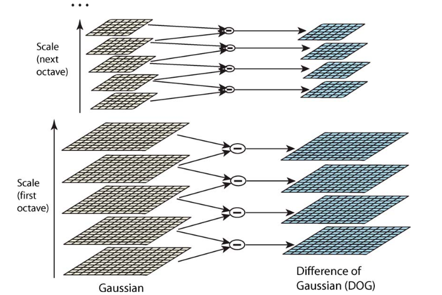
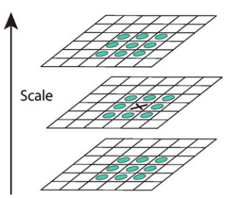
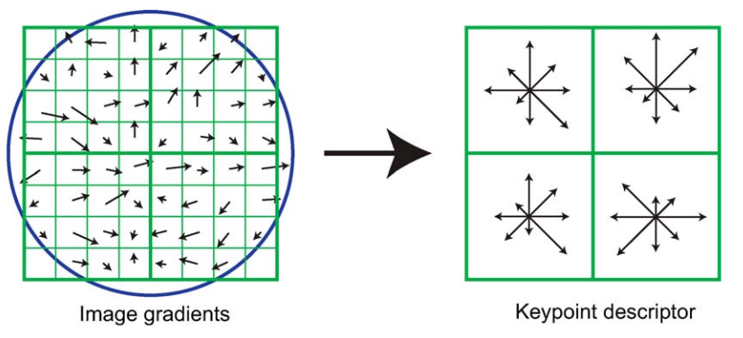

# <span class="topic-label">SLAM Basics</span> | SIFT特征

## 0.概述

SIFT特征[^sift]（Scale Invariant Feature Transform）是一种经典的局部特征描述算法，旨在从图像中提取对尺度缩放、旋转及光照变化具有较高鲁棒性的稳定特征点，常用于SLAM、三维重建等领域。SIFT特征核心流程包括四个阶段：

1. **尺度空间极值检测：**利用DoG函数构建尺度空间，并在多尺度下搜索候选特征点。  
2. **特征点细化：**通过二阶Taylor展开细化特征点的位置与尺度，并剔除低对比度点及边缘点。  
3. **方向计算：**基于邻域梯度直方图为特征点计算方向，赋予特征点旋转不变性。  
4. **描述子计算：**基于特征点邻域信息构建128维描述子，作为后续特征匹配的依据。

## 1. 理论基础

### 1.1 尺度空间

图像$I(x,y)$的尺度空间定义为函数$L(x,y,\sigma)$，满足：

\[
L(x,y,\sigma)=G(x,y,\sigma)*I(x,y)
\]

其中$*$为卷积运算，$G(x,y,\sigma)$为高斯核，满足：

\[
G(x,y,\sigma)=\frac{1}{2\pi\sigma^2}\exp\left(-\frac{x^2+y^2}{2\sigma^2}\right)
\]

### 1.2 候选特征点检测

尺度空间中的候选特征点定义为DoG函数（Difference of Gaussian）的局部极值，DoG函数$D(x,y,\sigma)$由尺度空间中相差常数因子$k$的两层计算，即：

\[
\begin{aligned}
D(x,y,\sigma)&=(G(x,y,k\sigma)-G(x,y,\sigma))*I(x,y)\\[5pt]
             &=L(x,y,k\sigma)-L(x,y,\sigma)
\end{aligned}
\]

采用DoG函数的原因有二：一是DoG函数可以简单地由尺度空间$L(x,y,\sigma)$计算，而$L(x,y,\sigma)$的获取是描述尺度空间必须进行的计算；二是DoG函数为尺度归一化LoG（Laplacian of Gaussian）函数$\sigma^2\nabla^2G$的近似，后者的局部极值被验证相较于梯度、Hessian和Harris响应函数可以产生最稳定的图像特征。

??? note "DoG函数近似尺度归一化LoG函数推导"
    高斯核$G(x,y,\sigma)$为热扩散方程的解，即有：

    \[
    \frac{\partial G}{\partial\sigma}=\sigma\nabla^2G\triangleq\sigma\left(\frac{\partial^2G}{\partial x^2}+\frac{\partial^2G}{\partial y^2}\right)
    \]

    因此有：

    \[
    \sigma\nabla^2G=\frac{\partial G}{\partial\sigma}\approx\frac{G(x,y,k\sigma)-G(x,y,\sigma)}{k\sigma-\sigma}
    \]

    \[
    \Rightarrow G(x,y,k\sigma)-G(x,y,\sigma)\approx(k-1)\sigma^2\nabla^2G
    \]

    \[
    \Rightarrow D(x,y,\sigma)\approx\sigma^2\nabla^2G*I(x,y)
    \]

    由于$k-1$为常数，其不影响局部极值位置，当$k\to1$时，近似误差$\to0$。

DoG函数的构造如[图](#fig-dog){.fig-ref}所示，具体步骤如下：

1. **尺度空间划分：**将每个倍频程（Octave，即尺度$\sigma$翻倍的过程）划分为$s$个等比间隔，确定相邻尺度的比例因子$k=2^{\frac{1}{s}}$。  
2. **增量式高斯卷积：**在每个倍频程中，对初始图像进行增量式高斯卷积，生成$s+3$张图像，即$s+3$层（Layer）。  
3. **计算DoG：**将相邻层图像作差，得到$s+2$张DoG图像，用于后续的局部极值检测。  
4. **倍频程迭代：**一个倍频程处理完后，选取其中尺度$\sigma$为初始值$2$倍的高斯图像（第$s$层），进行隔行隔列采样，作为下一个倍频程的初始图像。第$0$个倍频程的初始图像即为原始图像。

<figure id="fig-dog" markdown="span">
    {width="75%"}
    <figcaption>DoG函数构造</figcaption>
</figure>

DoG函数构造完成后，按照[图](#fig-extrema){.fig-ref}中的方式筛选局部极值点作为候选特征点，即候选特征点的响应值（DoG函数在该像素处的值）大于或小于上下两层和本层中相邻的26个点的响应值。

<figure id="fig-extrema" markdown="span">
    {width="75%"}
    <figcaption>DoG局部极值</figcaption>
</figure>

为了提取更多候选特征点，可对原始图像上采样作为第$0$个倍频程的初始图像，即用线性插值将原始图像的长宽各扩大$2$倍。假设原始图像的尺度为$\sigma=0.5$（防止混叠的最小值），则上采样图像的等效尺度为$\sigma=1.0$，无需额外平滑即可直接用于构造DoG函数。

### 1.3 特征点细化

对候选特征点进一步细化，可提高特征点稳定性且更易于匹配，为此，考虑DoG函数的二阶Taylor展开，即：

\[
D(x,y,\sigma)=D(\mathbf{x})\approx D(\mathbf{x}_0)+\frac{\partial D^\top}{\partial\mathbf{x}}(\mathbf{x}-\mathbf{x}_0)+\frac{1}{2}(\mathbf{x}-\mathbf{x}_0)^\top\frac{\partial^2D}{\partial\mathbf{x}^2}(\mathbf{x}-\mathbf{x}_0)
\]

其中$\mathbf{x}\triangleq(x,y,\sigma)^\top$，$\mathbf{x}_0$为上一步得到的候选特征点位置。定义$\delta\mathbf{x}=\mathbf{x}-\mathbf{x}_0$，令DoG函数二阶Taylor展开式关于$\delta\mathbf{x}$的导数为$0$，解得最优增量$\delta\mathbf{x}^*$：

\[
\delta\mathbf{x}^*=-\frac{\partial^2 D}{\partial\mathbf{x}^2}^{-1}\frac{\partial D}{\partial \mathbf{x}}
\]

实现时，$\frac{\partial D}{\partial\mathbf{x}}$和$\frac{\partial^2 D}{\partial\mathbf{x}^2}$由候选点位置$\mathbf{x}_0$与相邻像素的差分近似获取。若解得$\delta\mathbf{x}$在任意方向上大于$0.5$说明相比候选特征点位置$\mathbf{x}_0$，DoG函数的局部极大值更接近与$\mathbf{x}_0$相邻的某个像素，此时更新候选特征点位置，再次求解$\delta\mathbf{x}$。最终细化后的特征点位置$\hat{\mathbf{x}}$及响应值$D(\hat{\mathbf{x}})$分别为：

\[
\hat{\mathbf{x}}=\mathbf{x}_0+\delta\mathbf{x}
,\quad D(\hat{\mathbf{x}})=D+\frac{1}{2}\frac{\partial D^\top}{\partial\mathbf{x}}\hat{\mathbf{x}}
\]

响应值$D(\hat{\mathbf{x}})$低于阈值$T_\mathrm{res}$的特征点被丢弃。

#### 边缘效应消除

DoG函数会在跨越边缘时产生强烈的响应，SIFT作为一种斑点（Blob）特征，为提高稳定性，需要剔除边缘上的特征点。边缘上点的DoG函数会在跨越边缘方向产生较大的主曲率，同时在沿边缘方向产生较小的主曲率，利用这一特点可有效剔除边缘上的特征点。主曲率可由特征点处的Hessian矩阵$\mathbf{H}$计算：

\[
\mathbf{H}=\begin{bmatrix}D_{xx}&D_{xy}\\D_{xy}&D_{yy}\end{bmatrix}
\]

Hessian矩阵$\mathbf{H}$由特征点及其相邻像素差分近似。$\mathbf{H}$的特征值正比于主曲率，记$\alpha$和$\beta$分别为较大和较小的特征值，则有：

\[
\begin{gathered}
\mathrm{trace}(\mathbf{H})=D_{xx}+D_{yy}=\alpha+\beta,\\
\det(\mathbf{H})=D_{xx}D_{yy}-D_{xy}^2=\alpha\beta
\end{gathered}
\]

若行列式$\det(\mathbf{H})$为负，则特征点并非DoG函数的极值点，直接剔除。因此只需考虑行列式$\det(\mathbf{H})$为正的情况，此时$\alpha$与$\beta$具有相同的符号，记$\alpha=r\beta$，有：

\[
\frac{\mathrm{trace}(\mathbf{H})^2}{\det(\mathbf{H})}=\frac{(\alpha+\beta)^2}{\alpha\beta}=\frac{(r\beta+\beta)^2}{r\beta^2}=\frac{(r+1)^2}{r}
\]

当特征值$\alpha=\beta$时，$\frac{(r+1)^2}{r}$取到最小值，定义阈值$T_\mathrm{edge}$，并剔除所有满足

\[
\frac{\mathrm{trace}(\mathbf{H})}{\det(\mathbf{H})}\ge\frac{(T_{\mathrm{edge}}+1)^2}{T_{\mathrm{edge}}}
\]

的边缘特征点。

### 1.4 特征点的方向计算

为实现特征点的旋转不变形，根据特征点附近局部图像信息计算特征点的方向，进而在描述子计算时根据特征点的方向进行旋转校正。对每个特征点，选择尺度空间中与特征点尺度最接近的层计算方向，记该层图像为$L(x,y)$，定义梯度幅值$m(x,y)$和方向$\theta(x,y)$：

\[
\begin{gathered}
m(x,y)=\sqrt{[L(x+1,y)-L(x-1,y)]^2+[L(x,y+1)-L(x,y-1)]^2}\\
\theta(x,y)=\tan^{-1}\frac{L(x,y+1)-L(x,y-1)}{L(x+1,y)-L(x-1,y)}
\end{gathered}
\]

计算特征点邻域内每个点的梯度幅值$m(x,y)$和方向$\theta(x,y)$，并在均分$360^\circ$的$36$个区间内统计$\theta(x,y)$的加权直方图，每个加入直方图的样本由梯度幅值$m(x,y)$和$1.5$倍关键点尺度的高斯核加权。

直方图的最高峰及任何高于最高峰$80\%$的峰对应特征点的方向，换言之，同一尺度、同一位置的特征点可能具有多个方向。为提高精度，将每个对应方向的峰与相邻两个区间的值进行抛物线拟合，作为最终的方向。

### 1.5 描述子计算

描述子的计算由[图](#fig-descriptor){.fig-ref}所示，具体步骤如下：

<figure id="fig-descriptor" markdown="span">
    {width="75%"}
    <figcaption>SIFT描述子计算</figcaption>
</figure>

1. **邻域梯度计算：**与计算方向相似，选择尺度空间中与特征点尺度最接近的层，在该层上计算特征点邻域内的梯度幅值$m(x,y)$和方向$\theta(x,y)$，并基于特征点方向进行旋转校正，以实现旋转不变性。每一层的梯度可以预先计算以提高效率。  
2. **高斯加权：**使用$\sigma$为窗口宽度一半的高斯核加权邻域内每个点的梯度幅值$m(x,y)$，此操作一方面可以避免窗口位置微小变化导致的描述子突变；另一方面可以降低远离描述子中心梯度的权重，因为这些边缘区域易受离散化误差影响。  
3. **子区域直方图构建：**将特征点邻域划分为$4\times4$个子区域，在每个区域中统计$\theta(x,y)$的加权直方图，权重即为第2步中高斯加权的梯度幅值，每个直方图在梯度方向上设置8个区间。划分子区域是为了提高描述子对梯度偏移的鲁棒性，因为梯度小幅度偏移后，仍贡献相同子区域的直方图。  
4. **三线性插值：**描述子的边界效应指，当采样点从一个子区域移动至另一个子区域，或从一个直方图区间移动至另一个直方图区间时，描述子会产生突变。为削弱边界效应，采用三线性插值将每个采样点的值分配至相邻的直方图区间中。具体而言，每个采样点参与$x$、$y$坐标（决定采样点所处的子区域）和梯度方向$\theta(x,y)$三个分量上相邻的直方图，加入直方图的元素额外以$(1-d)$加权，$d$为采样点到直方图子区域中心（对应$x$、$y$坐标）和区间中心（对应梯度方向$\theta(x,y)$）的距离。  
5. **描述子向量构造：**描述子由包含所有子区域直方图各区间值的向量构成，由于特征邻域被分为$4\times4$个子区域，且每个子区域直方图具有$8$个区间，故描述子向量具有$4*4*8=128$维。  
6. **光照不变性处理：**  
    1. 对比度和亮度不变性：将描述子向量归一化为单位长度，以抵消图像对比度和亮度变化对梯度的影响。（前者相当于每个像素乘以固定常数，后者相当于每个像素叠加固定常数。）  
    2. 非线性光照处理：非线性光照变化可能导致某些梯度幅值发生较大变化，但通常不影响梯度方向。通过截断描述子向量中大于阈值$T_{\mathrm{illum}}=0.2$的部分，再进行归一化，减弱非线性光照变化对梯度分布的影响。

#### 特征匹配

特征点间的相似程度由对应描述子的欧氏距离度量，通过最近邻搜索、比例阈值测试等方法，可完成特征匹配。

## 2. OpenCV实现

- OpenCV版本：4.5.5

### 2.1 接口

OpenCV在`features2d`模块中提供了SIFT特征点检测与描述子计算[^opencv_sift]，接口如下：

```cpp linenums="1" title="SIFT实例化接口"
static Ptr<SIFT> cv::SIFT::create(
    int nfeatures            = 0,
    int nOctaveLayers        = 3,
    double contrastThreshold = 0.04,
    double edgeThreshold     = 10,
    double sigma             = 1.6
);

static Ptr<SIFT> cv::SIFT::create(
    int nfeatures,
    int nOctaveLayers,
    double contrastThreshold,
    double edgeThreshold,
    double sigma,
    int descriptorType
);
```

`nfeatures`：最多保留的特征点数，$0$表示不限，输出特征点按响应值排序。  
`nOctaveLayers`：每倍频程的层数$s$，倍频程数由输入图像分辨率自动计算。  
`contrastThreshold`：响应值阈值$T_\mathrm{res}$。  
`edgeThreshold`：边缘效应阈值$T_\mathrm{edge}$。  
`sigma`：第1倍频程初始高斯核$\sigma$。  
`descriptorType`：描述子数据类型，支持`CV_32F`和`CV_8U`，默认为`CV_32F`。 

---

```cpp linenums="1" title="SIFT特征提取&描述子计算接口"
virtual void cv::Feature2D::detectAndCompute(
    InputArray image,
    InputArray mask,
    std::vector<KeyPoint>& keypoints,
    OutputArray descriptors,
    bool useProvidedKeypoints = false
);
```

`image`：输入图像。  
`mask`：掩码，若为空则传入`cv::noArray()`。  
`keypoints`：输出特征点。  
`descriptors`：输出描述子，格式为$n\times128$，元素类型为`CV_32F`。  
`useProvidedKeypoints`：是否使用传入的特征点作为先验。

### 2.2 代码分析

```cpp linenums="1" title="SIFT特征提取&描述子计算实现"
// sift_dispatch.cpp
// 为保障代码连贯性，移除了安全检查和性能统计代码
void SIFT_Impl::detectAndCompute(
    InputArray _image, 
    InputArray _mask,
    std::vector<KeyPoint>& keypoints, 
    OutputArray _descriptors,
    bool useProvidedKeypoints) {

    int firstOctave = -1, actualNOctaves = 0, actualNLayers = 0;
    Mat image = _image.getMat(), mask = _mask.getMat();

    if( useProvidedKeypoints )
    {
        firstOctave = 0;
        int maxOctave = INT_MIN;
        for( size_t i = 0; i < keypoints.size(); i++ )
        {
            int octave, layer;
            float scale;
            unpackOctave(keypoints[i], octave, layer, scale);
            firstOctave = std::min(firstOctave, octave);
            maxOctave = std::max(maxOctave, octave);
            actualNLayers = std::max(actualNLayers, layer-2);
        }

        firstOctave = std::min(firstOctave, 0);
        actualNOctaves = maxOctave - firstOctave + 1;
    }
```

有先验点时（`useProvidedKeypoints == true`），根据先验点确定初始倍频程`firstOctave`，最大倍频程数`maxOctave`和每倍频程层数`acyualNLayers`。

```cpp linenums="30"
    Mat base = createInitialImage(image, firstOctave < 0, (float)sigma);
    std::vector<Mat> gpyr;
    int nOctaves = actualNOctaves > 0 ? actualNOctaves : cvRound(std::log( (double)std::min( base.cols, base.rows ) ) / std::log(2.) - 2) - firstOctave;

    buildGaussianPyramid(base, gpyr, nOctaves);

    std::vector<Mat> dogpyr;
    buildDoGPyramid(gpyr, dogpyr);
    findScaleSpaceExtrema(gpyr, dogpyr, keypoints);
    KeyPointsFilter::removeDuplicatedSorted( keypoints );

    if( nfeatures > 0 )
        KeyPointsFilter::retainBest(keypoints, nfeatures);

    if( firstOctave < 0 )
        for( size_t i = 0; i < keypoints.size(); i++ )
        {
            KeyPoint& kpt = keypoints[i];
            float scale = 1.f/(float)(1 << -firstOctave);
            kpt.octave = (kpt.octave & ~255) | ((kpt.octave + firstOctave) & 255);
            kpt.pt *= scale;
            kpt.size *= scale;
        }

    if( !mask.empty() )
        KeyPointsFilter::runByPixelsMask( keypoints, mask );

    if( _descriptors.needed() )
    {
        int dsize = descriptorSize();
        _descriptors.create((int)keypoints.size(), dsize, descriptor_type);

        Mat descriptors = _descriptors.getMat();
        calcDescriptors(gpyr, keypoints, descriptors, nOctaveLayers, firstOctave);
    }
}
```

### 2.3 完整使用示例

```cpp linenums="1" title="Example"
#include <iostream>
#include <vector>
#include <opencv2/core.hpp>
#include <opencv2/imgproc.hpp>
#include <opencv2/imgcodecs.hpp>
#include <opencv2/features2d.hpp>
#include <opencv2/highgui.hpp>

int main(int argc, char **argv) {
    
  if (argc < 2) {
      std::cerr << "Usage: " << argv[0] << " <image_path>" << std::endl;
      return -1;
  }
  cv::Mat img = cv::imread(std::string(argv[1]), cv::IMREAD_GRAYSCALE);

  // 创建 SIFT Detector
  int nfeatures = 500;
  int nOctaveLayers = 3;
  double constrastThreshold = 0.04;
  double edgeThreshold = 10;
  double sigma = 1.6;
  auto sift = cv::SIFT::create(nfeatures, nOctaveLayers, constrastThreshold, edgeThreshold, sigma);

  // 提取特征点，计算描述子
  std::vector<cv::KeyPoint> keypoints;
  cv::Mat descriptors;
  bool useProvidedKeypoints = false;
  sift->detectAndCompute(img, cv::noArray(), keypoints, descriptors, useProvidedKeypoints);

  cv::Mat display;
  cv::cvtColor(img, display, cv::COLOR_GRAY2BGR);
  for (const auto &kp : keypoints) {
    cv::circle(display, kp.pt, 2, cv::Scalar(0, 255, 0), -1);
  }
  cv::imshow("SIFT Keypoints", display);
  cv::waitKey(0);

  return 0;
}
```

[^sift]: D. G. Lowe, “Distinctive image features from scale-invariant keypoints,” International journal of computer vision, vol. 60, no. 2, pp. 91–110, 2004.

[^opencv_sift]: [OpenCV 4.5.5 SIFT Class Reference](https://docs.opencv.org/4.5.5/d7/d60/classcv_1_1SIFT.html)
