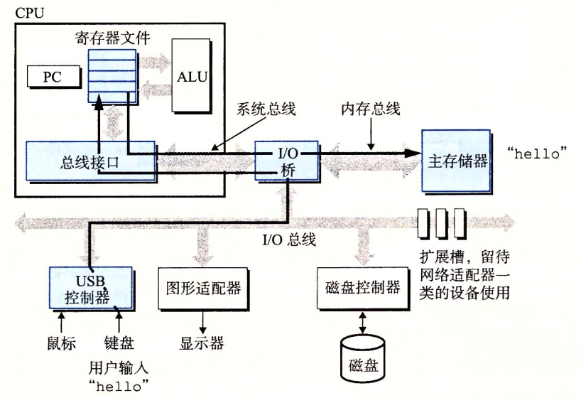
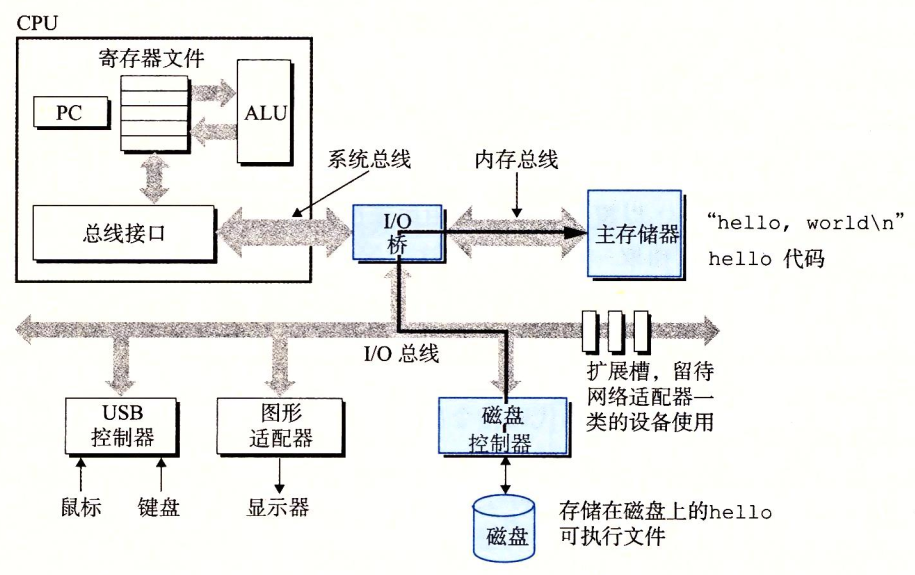
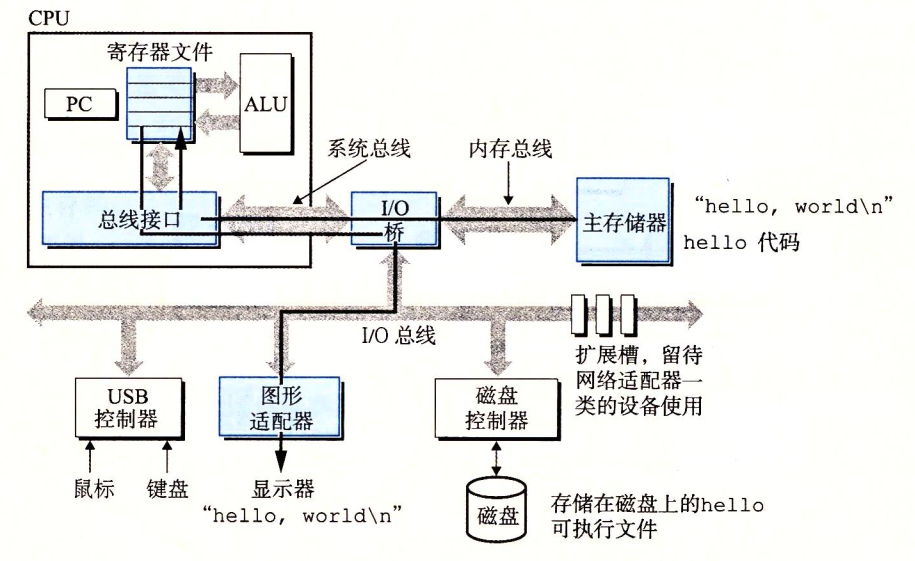
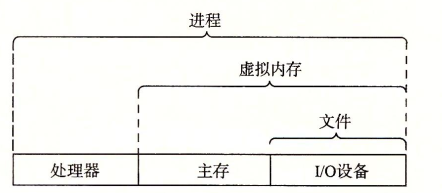
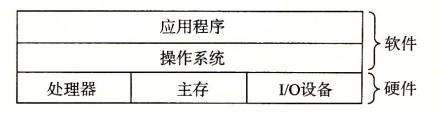
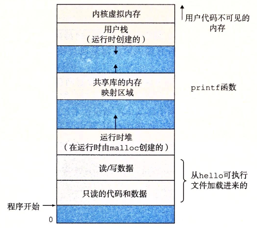

# <span class="topic-label topic-label--cs">深入理解计算机系统</span> | Ch1.计算机系统漫游

## 1. 信息

系统中的信息由二进制位（位、比特、bit）表示。上下文决定二进制位承载信息的含义。

- 8个二进制位组成字节（byte）
- 系统中的文件分为文本文件和二进制文件。文本文件多由ASCII字符组成。

## 2. 由源文件到可执行文件

以源文件`hello.c`为例：
```c
// file hello.c
#include <stdio.h>

int main() {
    printf("Hello, World!\n");
    return 0;
}
```


## 3. 系统的硬件组成

1. **总线：**传送定长（字，32/64位）字节块的链路。
2. **I/O设备：**鼠标、键盘、显示器、磁盘等。通过控制器/适配器与I/O总线相连。
3. **主存：**由DRAM组成，CPU执行程序时存放程序和数据。
4. **处理器（CPU）：**执行指令。CPU中具有程序计数器（PC）、寄存器文件、算数逻辑单元（ALU）等。
    1. **PC：**寄存器，大小为一个字，始终指向下一条指令地址。
    2. **寄存器文件：**由若干功能各异的寄存器组成。
    3. **ALU：**负责具体运算。

CPU执行指令的操作包括：

- **加载：**从主存复制一个字节/字到寄存器，覆盖寄存器原有内容。
- **存储：**从寄存器复制一个字节/字到主存，覆盖主存原有内容。
- **运算：**将两个寄存器的内容复制到ALU，并将ALU运算的结果放到一个寄存器，覆盖其原有内容。
- **跳转：**从指令中获取地址（一个字），将其复制到PC中，覆盖PC原有内容。
等。

## 4. 运行程序

在Shell中键入`./hello`到字符串`"hello"`输出到显示器上的典型过程为：

<figure id="run-hello-1" markdown="span">
    {width="75%"}
    <figcaption>从键盘读入`./hello`</figcaption>
</figure>

利用直接存储器存取（DMA）技术，数据可不经CPU直接由磁盘到主存。

<figure id="run-hello-2" markdown="span">
    {width="75%"}
    <figcaption>可执行文件`hello`从磁盘加载到主存</figcaption>
</figure>

CPU执行`hello`程序中的指令，将字符串`"hello"`由主存复制到寄存器，再复制到显示器。

<figure id="run-hello-3" markdown="span">
    {width="75%"}
    <figcaption>字符串`"hello"`输出到显示器</figcaption>
</figure>

## 5. Cache

高速缓存存储器（Cache Memory，简称Cache），基于SRAM，访问速度快于主存（DRAM），常有多级（L1、L2…），可暂存CPU近期所需数据以提高性能。

- **速度/价格：**寄存器 > L1(SRAM) > L2(SRAM) > … > 主存(DRAM) > 磁盘 > 远程存储

## 6. 操作系统

计算机系统应用程序和硬件之间的软件层（[图](#os-1){.fig-ref}），基本功能是（1）防止硬件被失控的程序滥用；（2）为应用程序提供抽象表示：进程、虚拟内存和文件（[图](#os-2){.fig-ref}）。

<figure id="os-1" markdown="span">
    {width="75%"}
    <figcaption>计算机系统层次关系</figcaption>
</figure>

<figure id="os-2" markdown="span">
    {width="75%"}
    <figcaption>操作系统提供的抽象表示</figcaption>
</figure>

### 6.1 进程

操作系统对一个正在运行程序的抽象。可同时运行多个进程，但每个进程看似独占地使用硬件。

- 操作系统通过**上下文切换**将控制权从当前进程转移至另一进程。
- 上下文切换通过**内核（kernel）**实现，内核是操作系统代码常住主存的部分。操作系统通过**系统调用（system call）**指令，将控制权转移至内核。
- **线程**：单个进程的多个执行单元，同处所属进程的上下文中，共享代码和全局数据。

### 6.2 虚拟内存

进程的虚拟地址空间，为每个进程提供独占主存假象。

<figure id="vm" markdown="span">
    {width="75%"}
    <figcaption>进程的虚拟地址空间</figcaption>
</figure>

虚拟地址空间的地址从低到高对应：

1. **程序代码和数据：**由可执行文件决定，数据对应C中的全局变量。
2. **堆：**运行时堆，大小动态。
3. **共享库**
4. **栈：**用户栈，大小动态，实现函数调用。
5. **内核虚拟内存：**由内核操作，应用程序不可及。

### 6.3 文件

字节序列，表示所有I/O设备，包括网络。

## 7. Amdahl定律

> Amdahl（阿姆达尔，/ˈæmdɑːl/）

优化系统某部分的性能，对系统整体性能的影响取决于该部分的重要性和加速程度。

定量而言，系统执行程序原时间为$T_\mathrm{old}$，系统某部分执行时间占原时间的$\alpha$，该部分优化后性能提升$k$，优化后系统执行程序时间为$T_\mathrm{new}$，则加速比$S$：

\[
S=\frac{T_\mathrm{old}}{T_\mathrm{new}}=\frac{1}{(1-\alpha)+\alpha/k}
\]

??? note "推导"
    \[
    S=\frac{T_\mathrm{old}}{T_\mathrm{new}}=\frac{T_\mathrm{old}}{(T_\mathrm{old}-\alpha T_\mathrm{old})+\alpha T_\mathrm{old}/k}=\frac{1}{(1-\alpha)+\alpha/k}
    \]

## 8.并发和并行

- **并发：**同时具有多个活动的系统。
- **并行：**利用并发加速系统。

按照抽象程度从高到低：

1. **线程级并发：**一个进程中执行多个控制流（线程）。
2. **指令级并行：**同时执行多条指令。
3. **单指令、多数据（SIMD）并行：**一条指令操作多条数据。