# Mermaid 简明教程

Mermaid 是一种使用文本描述图表的工具。它可以把简短的代码渲染成流程图、架构图、时序图、类图等，适合和 Markdown 一起使用。

本文面向第一次使用 Mermaid 的读者，示例可以直接复制到支持 Mermaid 的 Markdown 编辑器中。

## 1. Mermaid 适合做什么

Mermaid 特别适合以下场景：

- 绘制程序执行流程和业务流程。
- 表示系统模块、服务和数据之间的关系。
- 描述客户端、服务器和接口之间的交互顺序。
- 表示类、状态、数据库实体和 Git 分支。
- 将图表和文章源码放在一起，方便版本管理和修改。

Mermaid 的优点是上手简单、文本格式易于维护，并且可以直接写入 Markdown。它不适合替代需要精细排版的专业制图软件。

## 2. 在 Markdown 中使用 Mermaid

Mermaid 图表通常写在 `mermaid` 代码块中：

````markdown

````

代码块的第一行决定图表类型，后面的内容描述节点和连接关系。

## 3. 流程图基础

### 3.1 创建一个最简单的流程图


其中：

- `flowchart` 表示流程图。
- `LR` 表示从左到右排列。
- `A`、`B`、`C` 是节点 ID。
- 方括号中的文字是页面上显示的内容。
- `-->` 表示带箭头的连接线。

### 3.2 设置流程方向

```text
flowchart LR    从左到右
flowchart RL    从右到左
flowchart TD    从上到下
flowchart TB    从上到下
flowchart BT    从下到上
```

`TD` 和 `TB` 在常见流程图中都表示从上到下。

### 3.3 节点形状


常用写法如下：

```text
A[普通矩形]
B(圆角矩形)
C{判断节点}
D((圆形节点))
E[(数据库)]
F>旗帜形节点]
```

节点 ID 建议使用英文或数字，显示文字可以使用中文。例如：

```text
compiler[编译器]
```

这里的 `compiler` 是节点 ID，`编译器` 是显示文字。

如果文字包含括号、冒号或其他特殊字符，可以使用引号：


`<br/>` 可以在节点内部换行。

## 4. 箭头和连接线


常用连接符：

- `-->`：实线箭头。
- `-.->`：虚线箭头。
- `==>`：粗线箭头。
- `---`：没有箭头的实线连接。

### 4.1 给箭头添加文字


也可以写成：

```text
A -- 预处理 --> B
```

通常推荐使用 `A -->|预处理| B`，结构更清楚。

## 5. 判断和分支

使用 `{}` 创建菱形判断节点，再通过箭头文字表示分支条件：

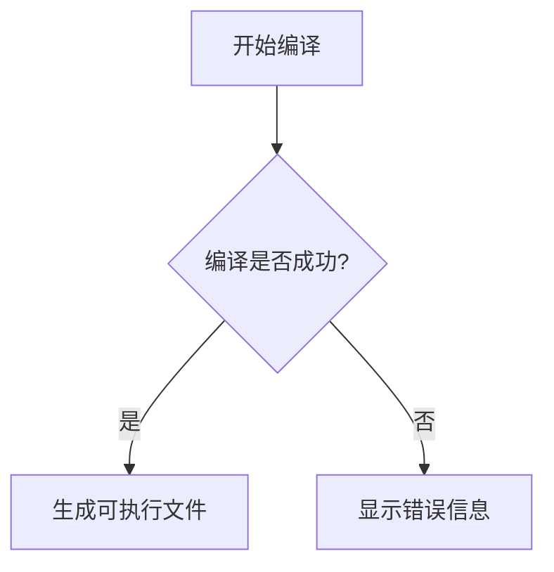

判断节点可以有多个出口：

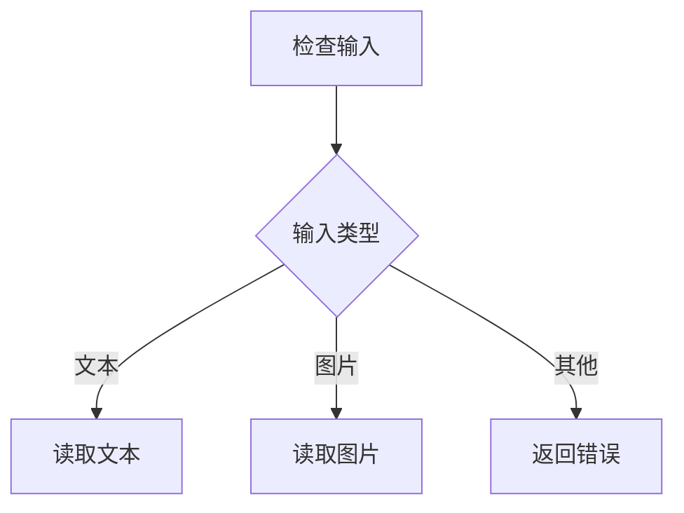

## 6. 子图和架构图

`subgraph` 可以把相关节点放入同一个区域，适合表达系统模块或处理阶段：

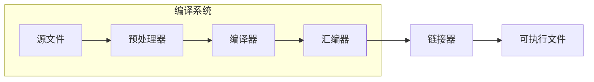

一个简单的系统架构图可以这样写：

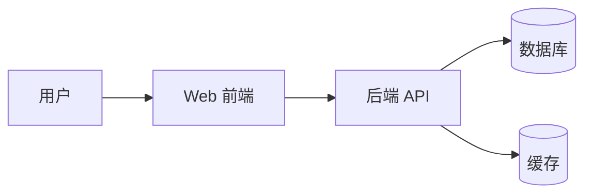

架构图的关键是先确定系统中的对象，再用箭头表达调用、数据流或依赖关系。不要一开始就添加过多细节，否则图表会很快变得难以阅读。

## 7. 一个完整示例：从源文件到可执行文件

以 C 程序为例，源文件通常会经历预处理、编译、汇编和链接四个阶段：


这张图的结构可以概括为：

```text
源文件 -> 预处理文件 -> 汇编代码 -> 目标文件 -> 可执行文件
```

## 8. 时序图

时序图适合描述多个参与者之间按时间发生的交互：

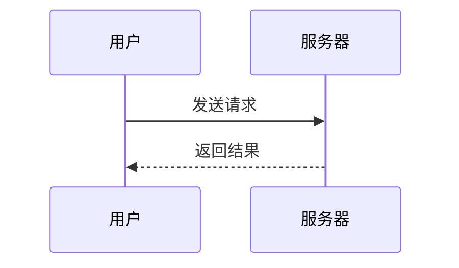

常见写法：

- `participant U as 用户`：声明参与者。
- `U->>S`：从用户向服务器发送实线消息。
- `S-->>U`：服务器向用户返回虚线消息。

一个稍复杂的例子：

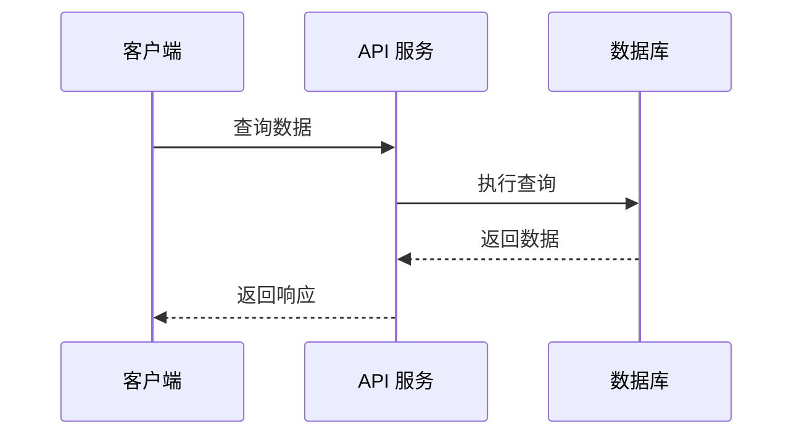

## 9. 状态图

状态图适合描述一个对象或系统在不同状态之间的变化，例如进程生命周期、网络连接状态、任务状态和订单状态。Mermaid 使用 `stateDiagram-v2` 开始一个状态图。

### 9.1 状态和转移

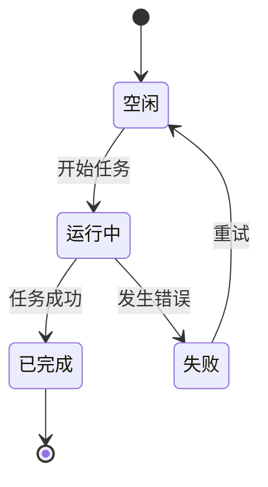

其中：

- `[*]` 表示初始状态或终止状态。
- `空闲`、`运行中` 和 `已完成` 是状态。
- `空闲 --> 运行中` 表示状态转移。
- `: 开始任务` 是转移条件或触发事件。

状态名称包含空格或特殊字符时，可以使用别名：

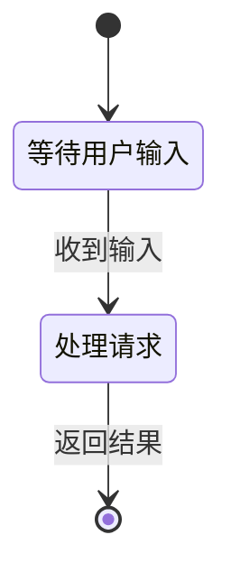

左侧的 `Waiting` 和 `Processing` 是内部 ID，图中显示的是引号中的中文名称。

### 9.2 条件转移

使用 `choice` 表示根据条件选择不同路径：

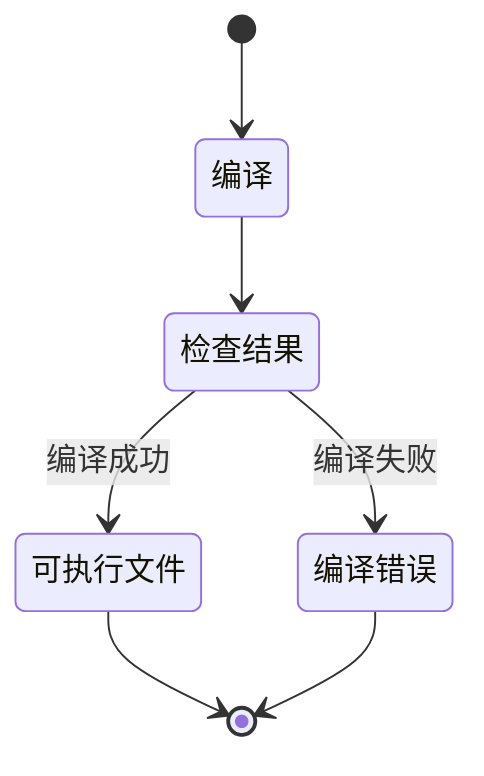

### 9.3 复合状态

使用 `state { ... }` 把多个子状态组织到一个复合状态中：

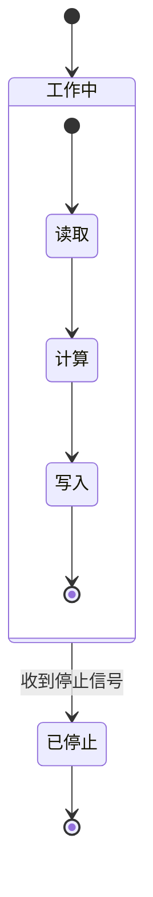

状态图的绘制思路是：先列出系统可能处于的状态，再确定触发状态变化的事件，最后补充异常路径和结束状态。

## 10. Mermaid 支持的其他图表

常见图表类型如下：

| 类型 | 关键字 | 适用场景 |
| --- | --- | --- |
| 流程图 | `flowchart` | 流程、架构、数据流 |
| 时序图 | `sequenceDiagram` | 服务和对象之间的交互 |
| 类图 | `classDiagram` | 类、属性、方法和继承关系 |
| 状态图 | `stateDiagram-v2` | 状态机和生命周期 |
| ER 图 | `erDiagram` | 数据库实体关系 |
| Git 图 | `gitGraph` | 分支和提交历史 |
| 思维导图 | `mindmap` | 知识结构和主题发散 |

对技术博客来说，优先掌握 `flowchart`、`sequenceDiagram` 和 `stateDiagram-v2` 就能覆盖大多数简单示意图需求。

### 10.1 类图

类图适合表示类、属性、方法和继承关系：

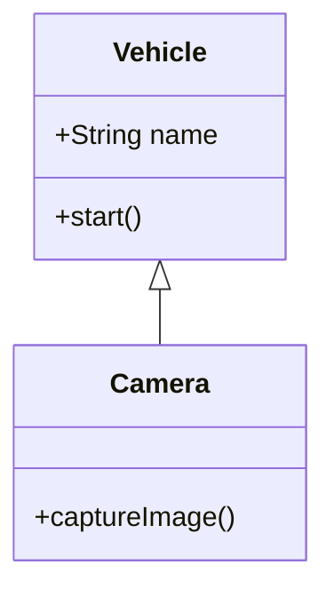

`<|--` 表示继承关系，`+` 表示公有成员。

### 10.2 ER 图

ER 图适合表示数据库实体和实体之间的关系：

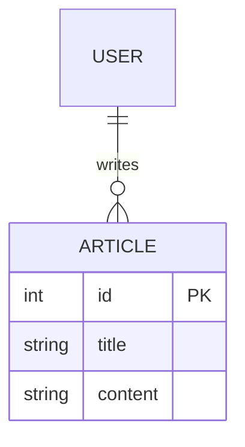

`||--o{` 表示一个用户可以写多篇文章，`PK` 表示主键。

### 10.3 Git 图

Git 图适合展示分支和提交关系：

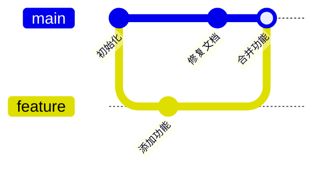

### 10.4 思维导图

思维导图适合组织知识结构。它主要通过缩进表达层级：

```mermaid
mindmap
    root((计算机系统))
        硬件
            处理器
            主存
            I/O 设备
        软件
            编译器
            操作系统
            应用程序
```

### 10.5 状态图、类图和 ER 图的选择

- 关注“系统现在处于什么状态”：使用 `stateDiagram-v2`。
- 关注“对象有哪些属性和方法”：使用 `classDiagram`。
- 关注“数据库中有哪些实体及其关系”：使用 `erDiagram`。

## 11. 在 MkDocs 中配置 Mermaid

VS Code 中安装 Mermaid 扩展，只能提供编辑器内的语法高亮和预览。要让 MkDocs 生成的网站显示 Mermaid 图，还需要配置 Markdown 解析器和浏览器端脚本。

### 11.1 配置 `pymdownx.superfences`

在 `mkdocs.yml` 中配置 Mermaid 自定义代码块：

```yaml
markdown_extensions:
  - pymdownx.superfences:
      custom_fences:
        - name: mermaid
          class: mermaid
          format: !!python/name:pymdownx.superfences.fence_code_format
```

### 11.2 加载 Mermaid JavaScript

在 `mkdocs.yml` 中增加 Mermaid 脚本：

```yaml
extra_javascript:
    - path: javascripts/mermaid-init.js
        type: module
```

推荐固定 Mermaid 的具体版本，避免 CDN 自动升级造成渲染结果变化。

### 11.3 创建初始化脚本

在 `docs/javascripts/mermaid-init.js` 中写入：

```javascript
import mermaid from "https://cdn.jsdelivr.net/npm/mermaid@11.12.1/dist/mermaid.esm.min.mjs";

mermaid.initialize({
    startOnLoad: false,
});

document.querySelectorAll("pre.mermaid").forEach((pre) => {
    const container = document.createElement("div");
    container.className = "mermaid";
    container.textContent = pre.textContent;
    pre.replaceWith(container);
});

mermaid.run({
    querySelector: ".mermaid",
});
```

这里使用 Mermaid 的 ESM 入口，并将 MkDocs 生成的 `pre.mermaid` 转换为 Mermaid 原生容器后渲染。配置完成后，Markdown 中的 ` ```mermaid ` 代码块才会在网站中变成真正的图表。

### 11.4 推荐的样式管理方式

建议采用“全站统一、单图强调”的两层方式：

1. **全站默认样式**：统一放在 `docs/javascripts/mermaid-init.js`，设置字体、默认字号、节点基础颜色和连线颜色。所有文章中的 Mermaid 图都会自动使用这套风格。
2. **文章级配置**：通常不需要在每篇文章中重复初始化 Mermaid，避免不同文章出现不一致的基础样式。
3. **单图局部样式**：只有当节点具有明确语义差异时，在该图内部使用 `classDef` 和 `:::样式名` 做强调，例如用不同颜色区分输入、处理过程和输出。

单图样式示例：

```mermaid
flowchart LR
    A[输入]:::input --> B[处理]:::process --> C[输出]:::output

    classDef input fill:#e8f5e9,stroke:#2e7d32,color:#1b5e20
    classDef process fill:#eef6ff,stroke:#1769aa,color:#16324f
    classDef output fill:#fff1d6,stroke:#b45309,color:#7c2d12,font-weight:bold
```

样式职责可以简单记为：

| 配置位置 | 作用 | 推荐程度 |
| --- | --- | --- |
| `mermaid-init.js` | 整个仓库的默认风格 | 推荐作为基础 |
| 每篇 Markdown 文件 | 文章特殊主题或局部覆盖 | 尽量少用 |
| 单个 Mermaid 图的 `classDef` | 节点语义强调 | 按需使用 |

这样既能保证博客整体视觉统一，又能让重要节点在需要时突出显示。

## 11. 编辑和调试建议

1. 先在独立的 `.mmd` 文件中编写图表，使用 VS Code Mermaid 扩展预览。
2. 确认图表的第一行是正确的图表类型，例如 `flowchart LR`。
3. 节点 ID 保持唯一，显示文字和节点 ID 分开处理。
4. 箭头文字尽量简短，避免一条线上的标签过长。
5. 修改后运行 `mkdocs build --strict`，检查 MkDocs 配置和 Markdown 是否有错误。
6. 如果编辑器能显示、网站不能显示，优先检查 `superfences`、Mermaid JavaScript 和浏览器控制台错误。

## 12. Mermaid 与其他工具的选择

| 工具 | 特点 | 适合程度 |
| --- | --- | --- |
| Mermaid | Markdown 友好，语法简单，支持图表类型丰富 | 最推荐 |
| PlantUML | UML 能力强，需要额外服务或 Java 环境 | 推荐 |
| D2 | 架构图表现较好，但 MkDocs 集成不如 Mermaid 直接 | 可选 |
| Graphviz | 适合严格的拓扑图和依赖图 | 局部使用 |
| diagrams.net | 可视化编辑方便，但图通常以图片形式保存 | 不适合作为主方案 |

对于本博客，建议使用以下组合：

- Mermaid：流程图、架构图、时序图和模块关系图。
- Graphviz：复杂依赖关系或自动生成的拓扑图。
- 普通图片：需要精细排版的最终插图。

## 13. MkDocs 有没有原生绘图工具

MkDocs 本身没有内置的流程图或架构图绘制语法。它主要负责将 Markdown 转换为 HTML，图表功能需要通过扩展或 JavaScript 工具接入。

因此，Mermaid 并不是 MkDocs 的原生功能，但它是和 MkDocs、Markdown 结合最方便的方案之一。
